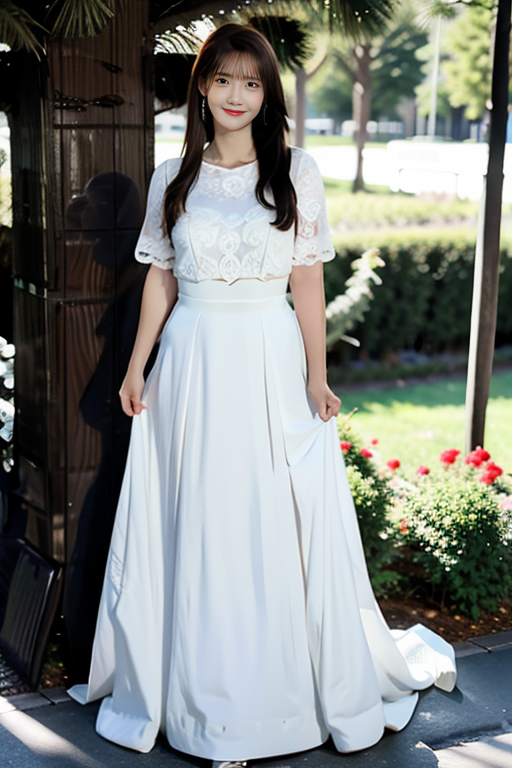
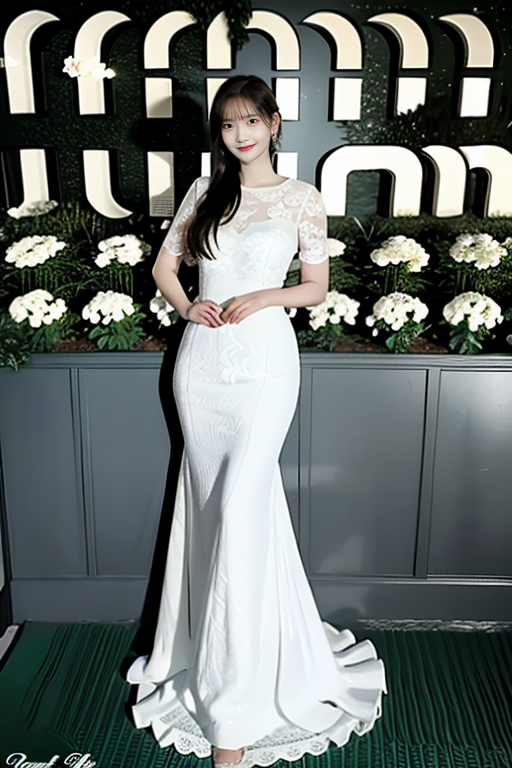

# java sdwebuiapi
JAVA API client for AUTOMATIC1111/stable-diffusion-webui

Supports txt2img, img2img API calls.

API support have to be enabled from webui. Add --api when running webui.
It's explained [here](https://github.com/AUTOMATIC1111/stable-diffusion-webui/wiki/API).

You can use --api-auth user1:pass1,user2:pass2 option to enable authentication for api access.
(Since it's basic http authentication the password is transmitted in cleartext)

API calls are (almost) direct translation from http://127.0.0.1:7860/docs 


## create API client

```
import org.springbus.sd.extensions.ADetailer;
import org.springbus.sd.extensions.ControlNetUnit;
import org.springbus.sd.model.ControlNet;
import org.springbus.sd.model.PILImage;
import org.springbus.sd.model.Txt2ImgModel;
import org.springbus.sd.model.WebUIApiResult;
import org.springbus.sd.utils.ImageUtil;

import java.util.List;
static String baseURL = "http://localhost:7860";

static String prompt = "masterpiece, best quality, wall paper, (8k, best quality, masterpiece:1.2),a woman,garden,Sexy, mature woman, wedding dress, smile,happy,flower,look at viewer,  full body, <lora:lye_v4:1>";
static String nsfw = "nsfw,(nipples),leakage points, big boobs, leather, net lining, mesh lining, paintings, big head, sketches, naked, (worst quality:2), (low quality:2), (normal quality:2), lowres, bad anatomy, bad hands, normal quality, ((monochrome)), ((grayscale)), futanari, full-package_futanari, penis_from_girl, newhalf, nipplepierces, glans penis, collapsed eyeshadow, multiple eyeblows, vaginas in breasts, pink hair, holes on breasts, ng_deepnegative_v1_75t, skin spots, acnes, skin blemishes, age spot, glans, nsfw, nipples,extra fingers, ((extra arms)), (extra legs), mutated hands,(fused fingers), (too many fingers), (long neck:1.3)";


# create API client
WebUIApi webUIApi = new WebUIApi(baseURL);
Txt2ImgModel txt2ImgModel = new Txt2ImgModel();
txt2ImgModel.prompt = prompt;
txt2ImgModel.negative_prompt = nsfw;
txt2ImgModel.batch_size = 4;
txt2ImgModel.width = 512;
txt2ImgModel.height = 768;


# optionally set username, password when --api-auth=username:password is set on webui.
# username, password are not protected and can be derived easily if the communication channel is not encrypted.
# you can also pass username, password to the WebUIApi constructor.
api.setAuth('username', 'password')
```

## txt2img
```

WebUIApiResult result1 = webUIApi.txt2Img(txt2ImgModel);

# images contains the returned images (PIL images)
List<PILImage> imageList = result1.getImages();

# image is shorthand for images[0]
result1.getImage();

# info contains text info about the api call
result1.info

# info contains paramteres of the api call
result1.parameters

result1.image
```


## txt2img with control net
```
        ControlNet net = new ControlNet();
        net.model = "control_v11p_sd15_canny [d14c016b]";
        net.module = "canny";
        net.input_image = ImageUtil.b64Img("./imgs/a.jpeg");
        ControlNetUnit controlNetUnit = new ControlNetUnit(net);

        WebUIApi webUIApi = new WebUIApi(baseURL);
        Txt2ImgModel txt2ImgModel = new Txt2ImgModel();
        txt2ImgModel.prompt = prompt;
        txt2ImgModel.negative_prompt = nsfw;
        txt2ImgModel.batch_size = 4;
        txt2ImgModel.width = 512;
        txt2ImgModel.height = 768;
        txt2ImgModel.withExtensions(controlNetUnit);
        WebUIApiResult r = webUIApi.txt2Img(txt2ImgModel);
        List<PILImage> imageList = r.getImages();
        int ix = 0;
        for (PILImage image : imageList) {
            image.save("./outs/imgs/controlnet-" + ix + ".png");
            ix++;
        }
```


## txt2img with  ADetailer
```
        ADetailer aDetailer = new ADetailer();
        aDetailer.ad_model = "face_yolov8n.pt";
        WebUIApi webUIApi = new WebUIApi(baseURL);
        Txt2ImgModel txt2ImgModel = new Txt2ImgModel();
        txt2ImgModel.prompt = prompt;
        txt2ImgModel.negative_prompt = nsfw;
        txt2ImgModel.batch_size = 4;
        txt2ImgModel.width = 512;
        txt2ImgModel.height = 768;
        txt2ImgModel.withExtensions(aDetailer);
        WebUIApiResult r = webUIApi.txt2Img(txt2ImgModel);
        List<PILImage> imageList = r.getImages();
        int ix = 0;
        for (PILImage image : imageList) {
            image.save("./outs/imgs/aDetailer-" + ix + ".png");
            ix++;
        }
```



### Configuration APIs
```
# get available sd models
api.getSdModels()

# misc get apis
api.getSamplers()
api.getCmdFlags()      
api.getHypernetworks()
api.getFaceRestorers()
api.getRealesrganModels()
api.getPromptStyles()
api.getArtistCategories() # deprecated ?
api.getArtists() # deprecated ?
api.getProgress()
api.getEmbeddings()
api.getCmdFlags()
api.getScripts()
api.getMemory()

# misc apis
api.interrupt()
api.skip()
```

 
 
